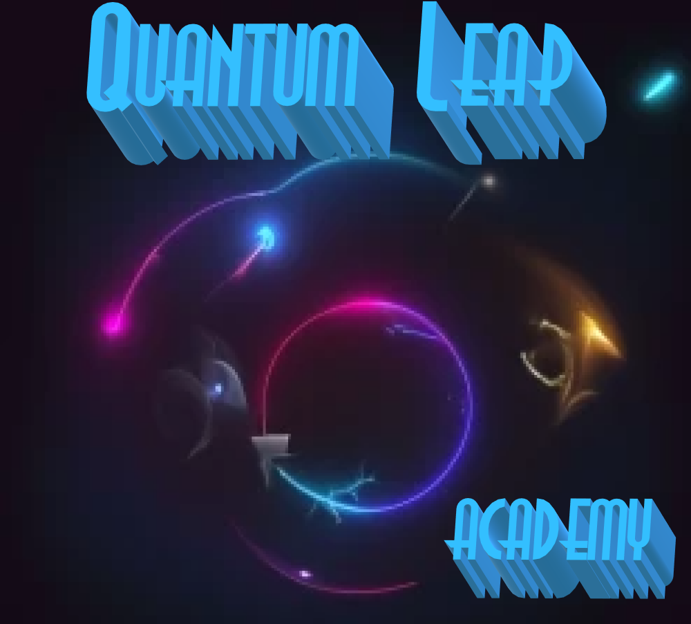

# Quantum Leap Academy

##  [Click here to start the Pre Leap](./gettingStarted/README.md) 

## What you have to look forward to once you finish pre-leap:

### Week 1
* [Java Programming Fundamentals](./gettingStarted/redirect.md)
* Homework Project:
  - [Cash Register](./gettingStarted/redirect.md)
  - `or`
  - [Deaf Grandma](./gettingStarted/redirect.md)

### Week 2
* [Java Object-Oriented Programming ](./gettingStarted/redirect.md)
* Homework Project: 
  - [Text Based Adventure Game](./gettingStarted/redirect.md)
  - `or`
  - [Zoo](./gettingStarted/redirect.md)

### Week 3
* [Java OOP and Libraries ](./gettingStarted/redirect.md)
* Homework Project: 
  - [Helicopters](./gettingStarted/redirect.md)
  - `or`
  - [Go Fish](./gettingStarted/redirect.md)

### Week 4
*  [Introduction to SQL and JDBC](./gettingStarted/redirect.md) 
*  [SQL and JDBC Application Development](./gettingStarted/redirect.md)
*  [Web Basics](./gettingStarted/redirect.md) 
* Homework Project:  [JDBC Actor Query Application](./gettingStarted/redirect.md) 

### Week 5
* [Dynamic Web Applications](./gettingStarted/redirect.md)
* [Introduction to Spring MVC](./gettingStarted/redirect.md)
* Group Project: [Spring MVC Film C.R.U.D.](./gettingStarted/redirect.md)

### Week 6
* [JPA](./gettingStarted/redirect.md)
* Homework Project: [Spring MVC C.R.U.D.](./gettingStarted/redirect.md)
* [Full Stack Group MVC Project](./gettingStarted/redirect.md)

### Week 7
* [RESTful Services](./gettingStarted/redirect.md)
* [Spring Data JPA](./gettingStarted/redirect.md)
* [JavaScript](./gettingStarted/redirect.md)

### Week 8
* [JavaScript](./gettingStarted/redirect.md)

### Week 9
* [React](./gettingStarted/redirect.md)

### Week 10
* [Final Project](./gettingStarted/redirect.md)
* [Final Review](./gettingStarted/redirect.md)

[Start](./gettingStarted/README.md)
