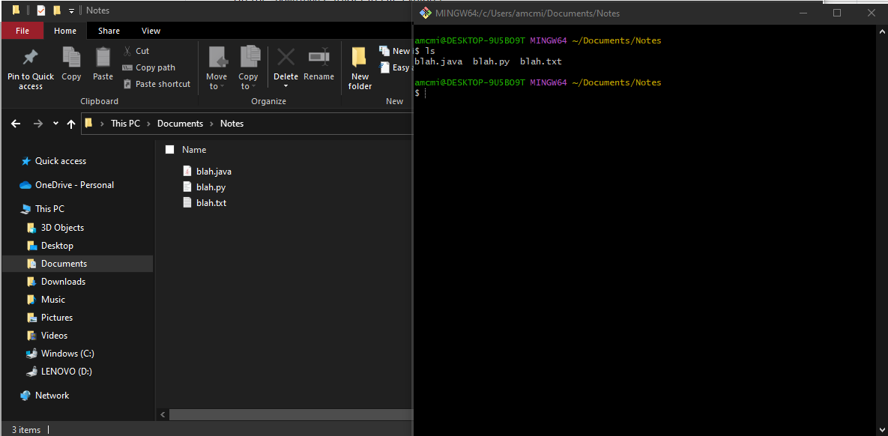

### `cd` & `mkdir` - *Change Directory (navigate through file system), Make Directory (create a folder)*

<hr />


* Your terminal window gives you the ability to navigate through and interact with your file system. When you open a new window you placed in your _HOME directory_ by default. On Mac OS, your HOME directory is `/c/Users/yourAccountName`.

  * In the _bash_ shell the HOME directory is represented by a `~`.

  * The terms _folder_ and _directory_ are interchangeable.

* You can navigate into the file system using a command `cd` or change directory. For example ```cd Downloads``` would move you from your HOME directory to your `Downloads` directory. This is the same as if you were to click on the `Downloads` folder in _File Explorer_.

* If you want to return to your HOME directory once your are inside your `Downloads` directory, you can traverse back up the file structure with

  ```bash
  cd ..
  ```

  * Or, you can use `~` to return to your ``HOME`` directory from anywhere:

    ```bash
    cd ~
    ```

  * Or, you can just type `cd`, which by default takes you to your ``HOME``.

    ```bash
    cd
    ```
* All of that is great and all but moving up and down the file structure can only be done if you know what files are in a directory. This is where ls (list files) comes into play.

#### `ls`- *List Files (list all files in your current location)*

* `ls` allows you to display the contents (files and folders) inside of your current location or any other directory.

* Lets take a look at the contents of a folder we will make in the next step called Notes and see how they correspond to what file explorer shows us.




<hr>

[Prev](unixCommands.md) | [Up](README.md) | [Next](mkdir-touch.md)

