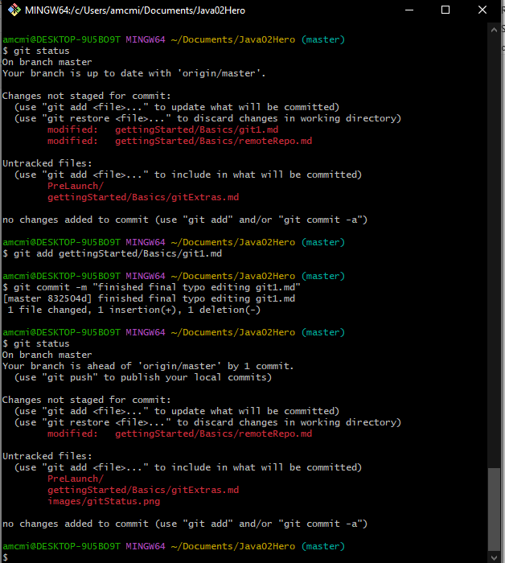
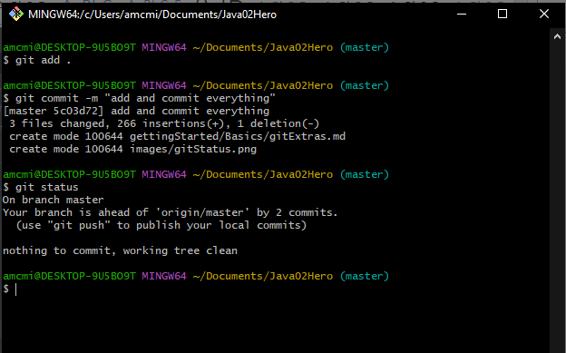
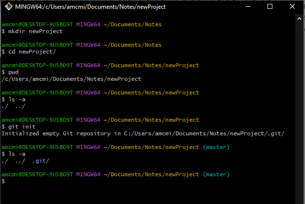
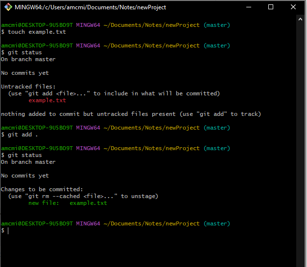
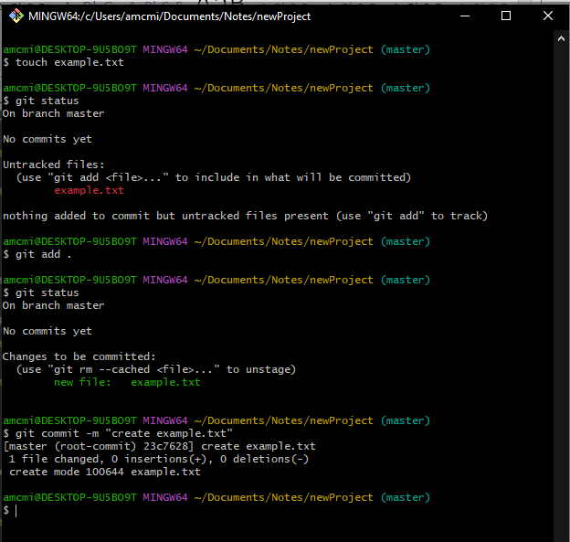
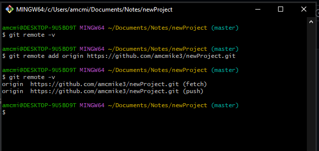
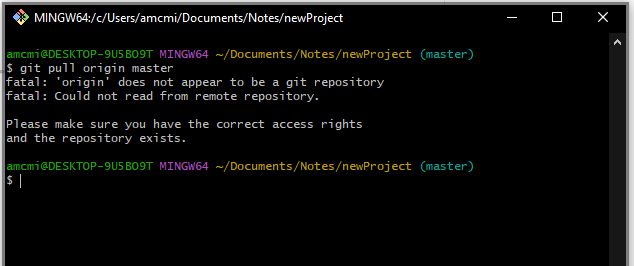
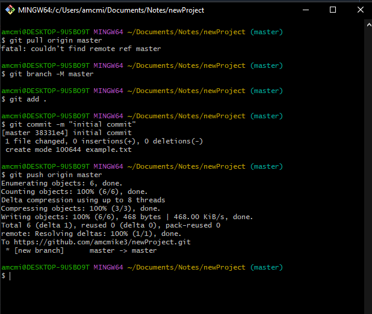
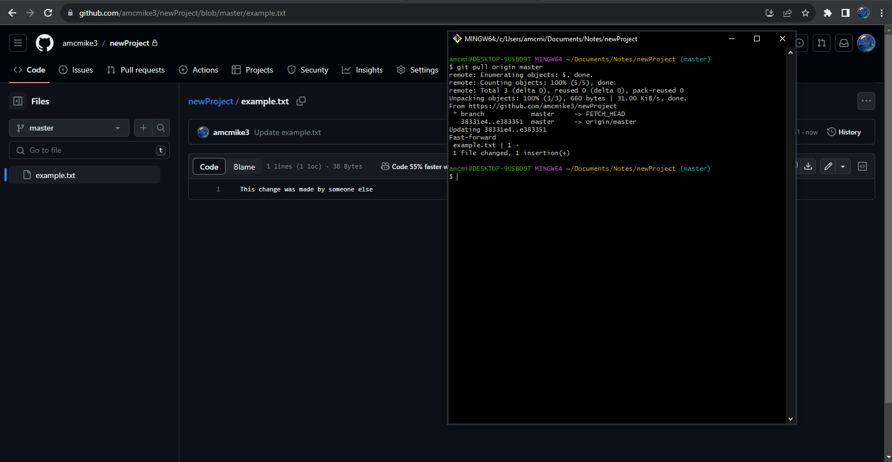
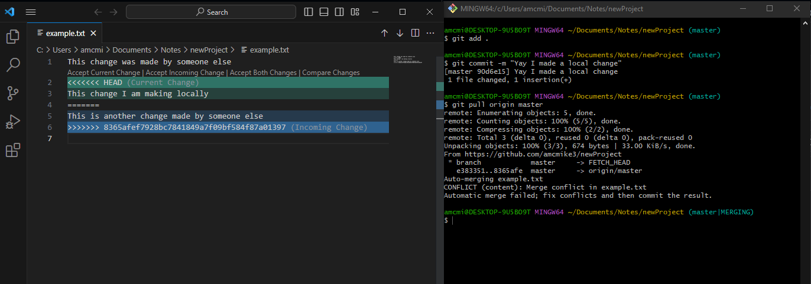

## Git 2: Utilizing and Troubleshooting `git`

### Introduction

Initially, Git may appear quite intimidating, and you might worry about accidentally breaking something or overwriting code. You might feel confused about what's happening, why things aren't working, and where they're going wrong.

This guide, aims to demystify Git's inner workings. It provides you with straightforward steps to follow, ensuring you stay clear of pitfalls, and helps you comprehend why things go awry and how to remedy them.

Like many aspects of software development, Git becomes more understandable with practice, patience, and by closely inspecting the output of your commands.

### 1. `git status`

#### Purpose:

Lists file modifications since the last commit. In essence, `git status` enumerates all files altered (lines added/removed, files deleted, files created) since the last commit.

#### Visual Representation:



**Explanation:**

- `git status` indicates that 'gettingStarted/Basics/git1.md' is an untracked file.
- Staged the change to 'gettingStarted/Basics/git1.md' with `git add  gettingStarted/Basics/git1.md`.
- `git status` confirms that ' gettingStarted/Basics/git1.md' is now staged and ready to be committed.
- Committed the staged changes (i.e., file creation) using `git commit -m ""finished final typo editing git1.md""`.
- `git status` shows the files we still have not staged.
- Lets stage everything using `git add .`
- Lets commit everything we staged with `git commit -m "add and commit everything"`
- `git status` now reflects 'nothing to commit, working tree clean'



#### When to use it:

Use it frequently, especially before `git add`, `git commit`, `git pull`, or `git push`. `git status` is essential for understanding the local repository's status, so use it consistently to get a clear picture before doing any of the commands above.

#### Documentation: [Git Status Documentation](https://git-scm.com/docs/git-status)

### 2. `git init`

#### Purpose:

Initializes a folder as a Git Repository, allowing it to track changes to files and save those changes in commits (timestamped save points containing line changes).

#### Visual Representation:



**Explanation:**

- Created a new directory named 'newProject' using `mkdir newProject`.
- Navigated to 'newProject' with `cd newProject`.
- Confirmed the current working directory with `pwd`, which returned '/Users/sdkris/Desktop/newProject,' indicating I was in the new directory.
- Listed all files in the directory using `ls -a`, including hidden files (those starting with `.`). This revealed no files in the directory.
- Executed `git init` to initialize the directory as a Git repository (creating a hidden `.git` directory).
- Confirmed that the directory was now a Git repository by checking with `ls -a`, which showed the hidden `.git` directory, indicating it was a repository.

#### When to use it:

Use `git init` when starting a new project that requires version control. It's crucial to initialize the top-level folder of the project as a Git repository. Avoid nesting Git repositories within each other, as this leads to problems.

#### Documentation: [Git Init Documentation](https://git-scm.com/docs/git-init)

### 3. `git add`

#### Purpose:

Stages changes to files for the next commit.

#### Visual Representation:



**Explanation:**

- Created a new file (example.txt) using `touch example.txt`.
- `git status` revealed that 'example.txt' was an untracked file.
- Staged the creation of 'example.txt' with `git add .`.
- `git status` confirmed that the creation of 'example.txt' was staged and ready to be committed.

#### When to use it:

Use `git add` whenever you complete a unit of work and are preparing to commit. During pre-work, this often means after writing a blog post or finishing an exercise. In a job setting, it could be after completing a feature or fixing a bug.

#### Documentation: [Git Add Documentation](https://git-scm.com/docs/git-add)

### 4. `git commit -m "some message"`

#### Purpose:

Records (creates a save point) changes in the repository.

#### Visual Representation:



**Explanation:**

- After staging the creation of the file using `git add example.txt` which we did above
- Executed `git commit -m "create example.txt"` to create a new commit that recorded the file's creation.
- The output provided information:
  - "create example.txt" was the message included with the commit using the `-m` (message) flag.
  - "1 file changed" indicates that one file was changed and how.
  - "create mode 100644 example.txt" shows that a new file was created and

 is now being tracked.

- Alternatively, you can add content to the file 'example.txt,' stage it, and commit it. 

**Note:** You won't commit every time you change a line or create a file. Commit when you complete a task, like a blog post, or an exercise, or a feature of a larger application.

#### When to use it:

Use `git commit` after staging changes with `git add <file>` and when you've completed a task. If `git status` doesn't show "nothing to commit, working tree clean," it means you need to commit to save your work.

#### Documentation: [Git Commit Documentation](https://git-scm.com/docs/git-commit)

### 5. `git remote add origin <url>`

#### Purpose:

Links a remote repository (located at a URL) to the current local repository using the alias 'origin.'

#### Visual Representation:



**Explanation:**

- `git remote -v` lists remote repositories connected to the current local repository. Initially, it displays nothing since the local repository isn't connected to a remote repository.
- `git remote add origin https://github.com/amcmike3/newProject.git` adds a reference to a remote repository located at the URL you provide and nicknames it 'origin.' (the proper software engineering term for nicknaming things is `alias`). So, we are creating an alias for the url and calling it origin.
- Running `git remote -v` now confirms the local repository is aware of a remote repository with the alias of 'origin' located at `https://github.com/amcmike3/newProject.git `.

#### When to use it:

Use `git remote add origin <url>` when you need to link a local repository to a remote repository, such as connecting your project files on your computer to a GitHub repository for sharing or collaboration.

#### Documentation: [Git Remote Documentation](https://git-scm.com/book/en/v2/Git-Basics-Working-with-Remotes)

### 6. `git pull origin master`

#### Purpose:

Fetches commits from the remote repository named 'origin' and attempts to merge them with your local repository's commit history.

#### Visual Representation:

- **Example 1**: No Remote Repo
  

    **Explanation:** The message "fatal: 'origin' does not appear to be a git repository
    fatal: Could not read from remote repository.
    " indicates that the you have not added your remote repo like the step above. This happens after initializing a new repository and creating one on Github but not adding the reference to the remote repository to your local git.

    * **Example 2** : No Master

* ***What Happened???***

  * After attempting to `git pull origin master`, the message `fatal : Couldn't find remote ref master` appeared.

  * This message means that the remote you tried to pull from does not have a branch that matches `master`. ***NOTE:*** this will only happen after initializing a new repository and before you create the master branch.

  * ***solution*** : `git branch -M master`, `git add`, `git commit -m "some message"`, and `git push origin master`.

- **Example 3**: Additional Refs
  
  **Explanation:** `git pull origin master` merges new commits from `origin`, which you didn't have locally. This automatically updates files with line changes from those commits. This occurs when the remote changes independently of your local (e.g., collaboration from other developers or direct edits from GitHub).

- **Example 4**: Merge Conflict
  
  **Explanation:** `git pull origin master` merges new commits from the remote and encounters a `CONFLICT`. Refer to "9. Merge Conflicts - Detection and Resolution" below.

#### When to use it:

Always attempt to pull before you push. When you intend to push code, pulling first ensures your local version is up to date with any changes that others have made. We wouldn't want to overwrite someone elses hard work.

#### Documentation: [Git Pull Documentation](https://git-scm.com/docs/git-pull)

### 7. `git push origin master`

#### Purpose:

Sends commits from your local repository to a remote repository named 'origin' and merges the commit histories (updating the remote with your local changes).

#### Visual Representation:

- **Example 1**: First Push
  
  **Explanation:** After pulling, `git push origin master` sent the local commits to the remote.

- **Example 2**: Subsequent Pushes
  
  **Explanation:** After adding, committing, and pulling, `git push origin master` sent the local commits to the remote.

#### When to use it:

Use `git push origin master` when you've completed a unit of work, after `git add <file(s)>`, `git commit -m "some message"`, and `git pull origin master`. During pre-work, this is often used to update your blog or send a completed exercise to GitHub.

#### Documentation: [Git Push Documentation](https://git-scm.com/docs/git-push)


### 8. Merge Conflicts - Detection and Resolution

#### What it is:

A merge conflict occurs when the same line(s) were changed in a file by separate commits. Your local repository has one version, and the remote repository has a different version. Git cannot decide which version is correct and, instead, prompts you to decide how to proceed.

Merge conflicts are immediately recognizable in the console when `CONFLICT` appears in the output following a `git pull`.

#### Visual Representation:

- **Terminal**:
  
  - A line like `CONFLICT (type) : Merge conflict in <file reference>` indicates a merge conflict. Go to the referenced file to identify the conflicting line.

- **Code**:
  
  - In code, a merge conflict appears as follows:

```java
<<<<<<< HEAD
This change I am making locally
=======
This is another change made by someone else
>>>>>>> 8365afef7928bc7841849a7f09bf584f87a01397

```

#### How to fix it:


1. Modify the code in the file as desired. What you keep and what you get rid of entirely depends on the circumstance of the merge conflict.
2. Remove the following lines:
   - `<<<<<<<< HEAD`
   - `========`
   - `>>>>>>>>> 8365afef7928bc7841849a7f09bf584f87a01397`
3. Stage the corrected file(s) with `git add <fileName>`.
4. Commit the corrected file(s) using `git commit -m "some message"`.

Merge conflicts may seem daunting initially but are designed to help you. Git expects you to edit the code, remove conflict markers, stage the changes, and commit the resolved version.

#### Documentation: [Git Merge Documentation](https://git-scm.com/docs/git-merge)

### 9. `git log`

#### Purpose:

`git log` displays the commit history for the current repository. Optionally, you can use a numeric flag (`git log -2`) to indicate the number of commits to show.

**Explanation:**

- If there are more commits than can fit on the screen and are prompted by a colon `:` you can enter `q` to exit. The colon simply means there are more commits than can fit on the screen and you can use the down arrow to see more.

#### When to use it:

Use `git log` when you want to review the differences between two commits, revert to a previous commit, or view the messages from your previous commits.

#### Documentation:
[Git Log Documentation](https://git-scm.com/docs/git-log)  
[Git Diff Documentation](https://git

-scm.com/docs/git-diff)


[Previous](git1.md) | [Up](README.md)

