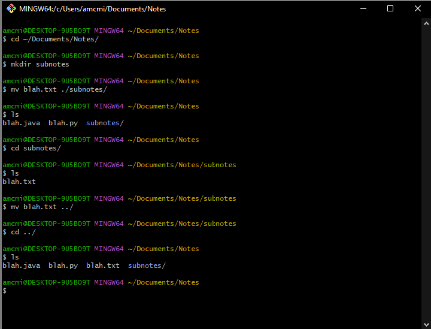
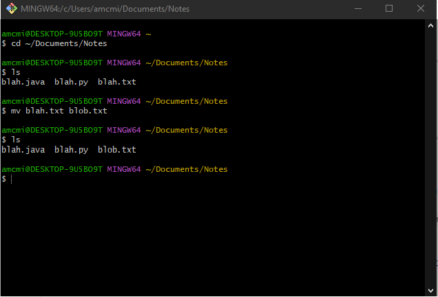
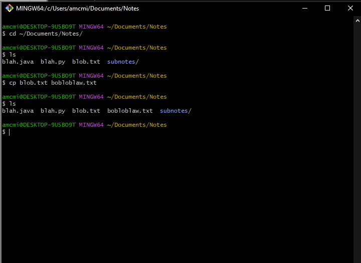

### `mv` and `cp`

#### `mv`- *Move (move a file)*

* Before now you probably are used to moving files by dragging and dropping them using _Finder_ or _Windows Explorer_.

  * You can also move files using the terminal with the `mv` command. `mv` takes two arguments, the file or folder you want to move and the location you want to move it to.

  * To move the `blah.txt` file that we created in the previous step. It is in the `notes` directory we created with `mkdir`.

  * in the picture below first we navigate to the notes folder with `cd ~/Documents/Notes`, then we make a sub directory called subnotes with `mkdir subnotes`. Next we can use `mv blah.txt ./subnotes/` to move blah.txt into subnotes. We can use `ls` to see that we created the subnotes folder and moved the blah.txt file. so lets traverse into subnotes with, you guessed it `cd subnotes/`. Again we use `ls` and see blah.txt is in the subnotes directory. Lets move it back into notes with `mv blah.txt ../`. next lets traverse up into the notes directory using `cd ../`. Finally using `ls` we see blah.txt successfully moved back into notes.

  * `mv` can also be used to rename a file. `mv blah.txt blob.txt` would rename a file called `blah.txt` as `blob.txt`.

#### `cp`- *Copy (make a copy of a file or directory)*

  * We can create duplicates of a file using the `cp` command. `cp` takes two arguments, the name of the file to copy first and the name for the new duplicated file second.

  * Lets make a copy of our `blob.txt` file called `bobloblaw.txt`. To do this we simply go to the right directory and input `cp blob.txt bobloblaw.txt`.

  

[Prev](touch-rm.md) | [Up](README.md) | [Next](touchTyping.md)
