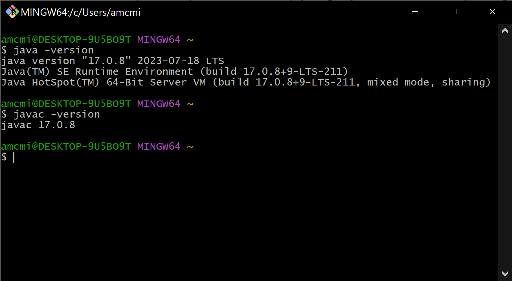

### Using the Git Bash

### Overview

_Git Bash_ is an application that provides a _command line interface_ to your computer's operating system (Windows). _Git Bash_ uses a _Unix shell_ named _bash_ to help you configure and modify files on your computer. This _bash_ shell is the same one found on the Unix and Linux systems that typically host web applications and is also the default Git Bash on MacOS.

We will be using our _Git Bash_ conveniently named _Git Bash_ to do things like run applications, navigate through the file system, create/move/copy files during the program. These exercises serve as a brief introduction to this important tool.

##### 1. Open Git Bash

On Windows, the easiest way to locate and open applications is with the search bar in the taskbar.

* Press `The windows button ⊞` and begin typing to search. In our case type `Git Bash`.

* As you type application and file suggestions will appear

During your time at Quantum Leap, you will be using _Git Bash_ extensively.  The _Windows Taskbar_ at the bottom of the desktop holds shortcuts to frequently-used programs.  Pin a shortcut to _Git Bash_ on the taskbar:

* Press `The windows button ⊞` and begin typing _GitBash_ to search until `GitBash` appears in the list.
* Right click GitBash and select pin to taskbar

##### 2. Check `java` and `javac` Version

Among the most important things you will use _Git Bash_ for is to compile and run Java applications. Before going any further, Lets double check the Java version you have like we did in the windows command line previously. `javac` is the command to run the program which compiles a Java file.

* Click into _Git Bash_ and type `java -version`, then press the `Enter` key. This should return information about the installed version of Java. If your output is similar to the output in the image below, then Java is installed.

* Now type `javac -version` and then press the `RETURN` key. If the output is `javac` followed by a version number, then you are setup and ready to continue.

* ***NOTE***: If either of the preceding commands failed to return a version of java 17, you will [need to follow these steps to install Java](../Setup/javaInstall.md).

[Prev](terminal.md) | [Up](README.md) | [Next](cd-ls.md)
