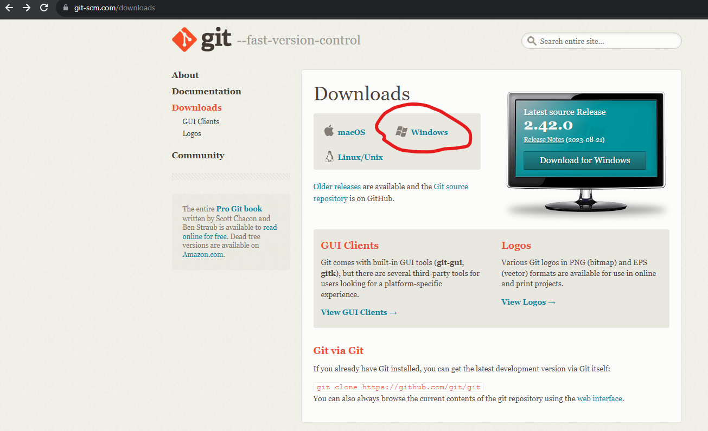
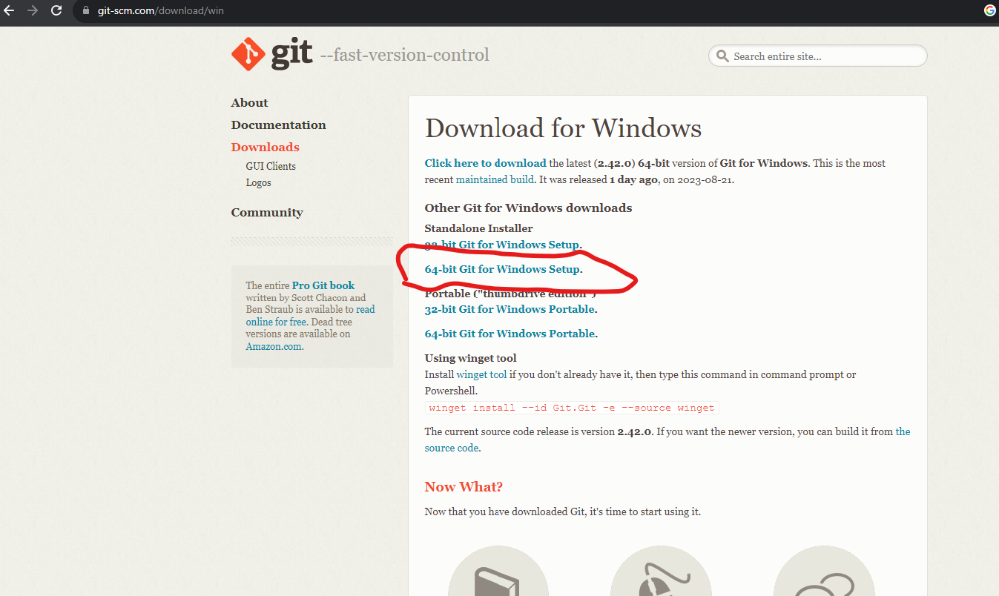

## Installing Git Bash

### Overview

Git Bash is an alternative command line. In your future career you might use a Windows, Mac, or even a Linux operating system. Git Bash will help you learn commands on the command line that can be applied to any of the operating systems.  

### 1. Download Git Bash
* Follow this link: [Git Bash](https://git-scm.com/downloads) and click on the Windows Icon.
 

 * Click on `64-bit Git for Windows Setup` this will download Git Bash

 

### 2. Install Git Bash
* In the last step you downloaded the Git Bash executable. Open the executable file, accept the default values for all options, and click next until instalation is complete.

Yay! Second step down three more to go!

[Prev](javaInstall.md) | [Up](README.md) | [Next](vscode.md)