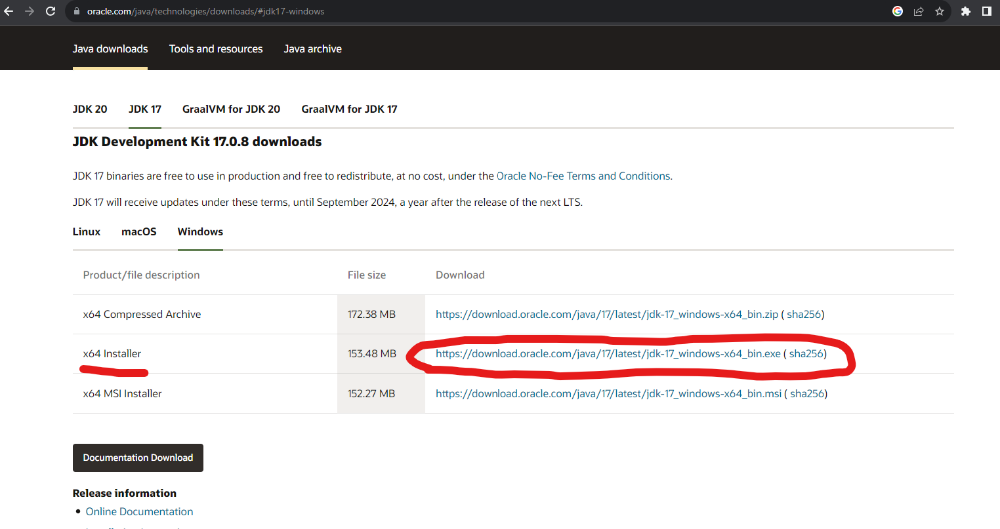
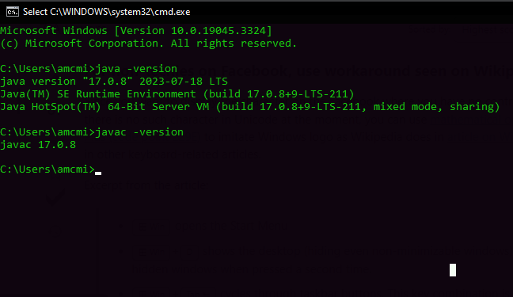

## Installing Java

### Overview

The core focus of this bootcamp is programming in the Java programming language and its supporting libraries and frameworks. Thus the first step is to download the Java language onto your computer.

### 1. Download the Java SE Development Kit (JDK)

* Oracle is the Company that owns Java and makes it freely available to redistribute, at no cost, under the Oracle No-Fee Terms and Conditions.

  * **important** The exact release number may differ just ensure you are downloading JDK Development Kit 17

* Go to the link below and download the x64 installer.
    * <a href="https://www.oracle.com/java/technologies/downloads/#jdk17-windows" target="_blank_">Java Install</a>
    
* Ensure you have clicked on the Windows tab if you can't find the x64 installer.

### 2. Install the JDK
In the last step you downloaded the Java 17 software development kit. Open the executable file that was just downloaded and follow the prompts keeping all default values.

### 3. Check Java Version

* Open the _Command Line_ by pressing the windows key and r `⊞ + R`

* type `cmd` (for command) and press enter

* In the Command Line, type `java -version` and press enter to see the installed Java version.

* Type `javac -version` and press enter to see the installed javac version.

Yay! you just used your the command line for the first time!! 

You deserve a well earned upgrade! in the next step we will install GIT BASH

[Prev](README.md) | [Up](README.md) | [Next](bash.md)

