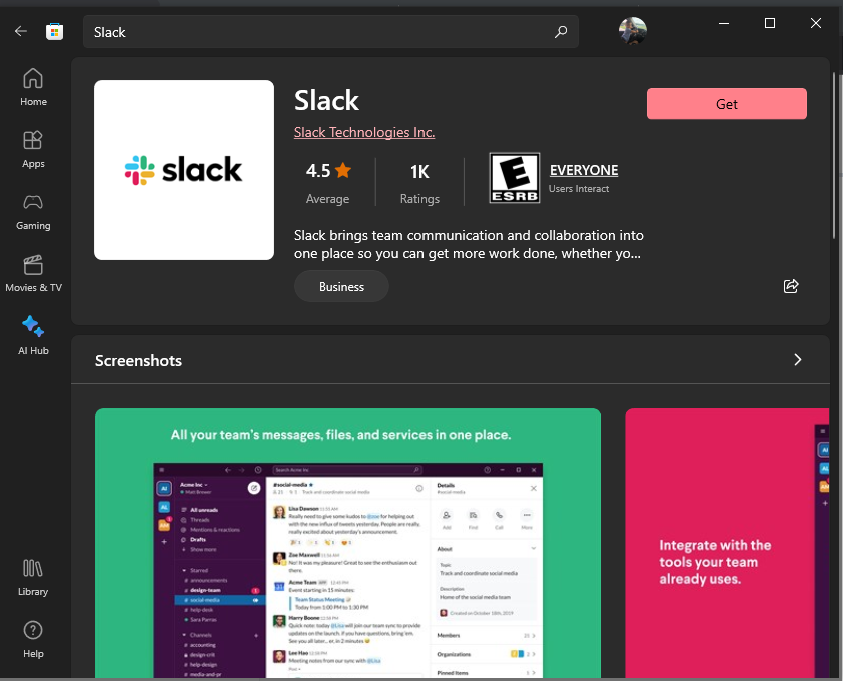

## Slack

### Overview
**Slack** is a free messaging service which is used for inter-office communication and collaboration. We will be using Slack to communicate regularly throughout this course. This page will walk you through installation.

### 1. Installing Slack

* Open the windows menu by pressing the windows key `⊞`
* type `store` in the search bar (if you don't have a search bar simply start typing `store`) and open the microsoft store.
* in the microsoft store search bar search for `slack` and click on it. It should look the same as the picture below.

* click the get button to download slack and once it is finished downloading click open.

### 2. Joining Our Slack Workspace

* Upon acceptance into this program you will have been sent a Slack invitation to the email you provided. Find that email or let us know if we need to resend it.

* Click the `Join Now` button.

* Create an account.

* Accept the customer service agreement. After you do this you will automatically be signed into the web version of Slack.

### 3. Adding a workspace to the Slack App

* Using spotlight search, open the slack app you downloaded.

* Click the add workspace button (`+`).

* Enter `QLPreLeap`.slack.com into the Slack URL.

* Enter the email and password you used when signing up for an account.

* Chat with your classmates!

### Channels

* You are automatically added to the **general** channel when you join our workspace.

* To join other channels, click on **Channels** in the left-side menu.

* In the **Browse channels** window you can see the names and purposes of other channels; to join one, click on it to see a preview, then click **Join Channel**.

[Prev](vscode.md) | [Up](README.md)

