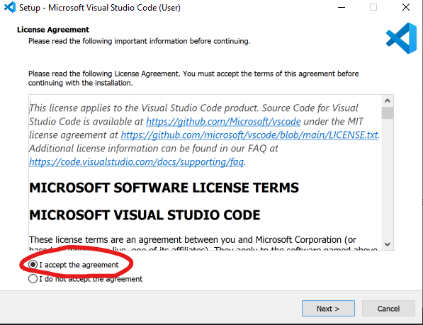

## Installing Visual Studio Code

### Overview

Over the course of this bootcamp we will need to edit text files as well as other types of files for the applications we will create. We will be using Visual Studio Code (VS Code) to do both. 

### 1. Download Visual Studio Code
* Follow this link: [VS Code](https://code.visualstudio.com/docs/?dv=win64user) and the proper executable file should be downloaded automatically

### 2. Install VS Code
* In the last step you downloaded the VS Code executable. Open the executable file, accept the terms, and click next.

* Select the options depicted in the picture below, and click next.

* Once those steps are completed follow the prompts to finish the installation.

[Prev](bash.md) | [Up](README.md) | [Next](slack.md)
